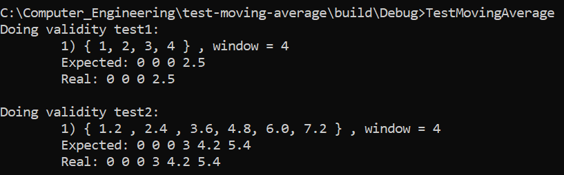
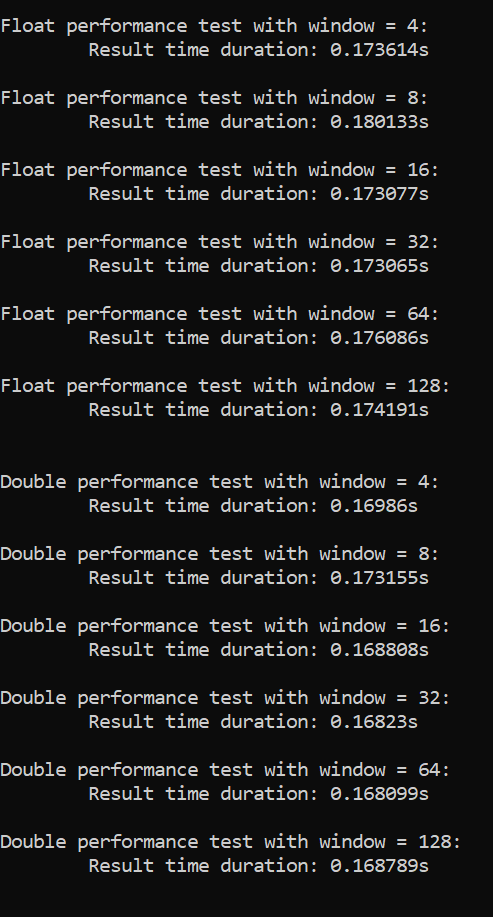
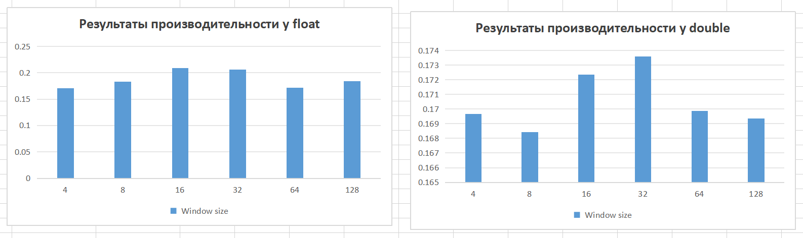

# Readme

Исходные файлы проекта, в котором реализован алгоритм простого скользящего среднего.

# Build

В качестве инструмента создания проекта использовался *CMake*, для сборки исполняемого файла - *Visual Studio 2017*.

# Run

При запуске исполняемого файла в консоль выведутся результаты двух тестов:


А также результаты проверки на производительность:


После выполнения программы рядом с файлом будет находиться `result.csv` файл в таком виде:
```
Type    Window size     Duration
float   4               ...
float   8               ...
...
double  4               ...
...
```
По этим значениям можно построить графики. В моём случае они выглядели так:
